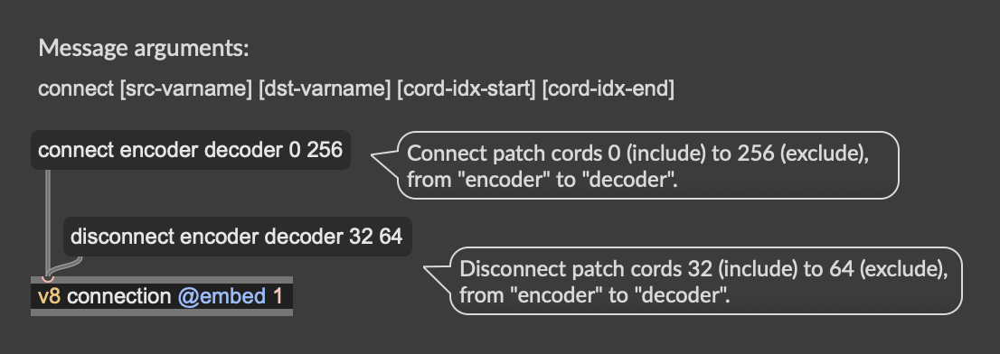

# Streamable SAME Autoencoder 

Export the **SAME-S (Semantically-Aligned Music Autoencoder)** autoencoder in [Stable Audio 3](https://github.com/Stability-AI/stable-audio-3) to TorchScript for the [`nn~`](https://github.com/acids-ircam/nn_tilde) external in Max/MSP and PureData, for realtime continuous inference. 

It adds a **causal overlap** (each call runs over cached buffer + new buffer) to enable streamable continuous inference, without clicking artefacts.

https://github.com/user-attachments/assets/5c98585f-cb74-4653-aabc-a565c4262ca0


## Install
We use [`uv`](https://docs.astral.sh/uv/) for fast, lightweight installs.

```bash
uv sync
```
(This will local clone of `stable-audio-3` next to this repo, see `[tool.uv.sources]` in
`pyproject.toml`).


## Export

```bash
# default device auto-selects mps/cuda/cpu
uv run streamable-same-s-export --device cpu --validate --out same_s.ts
```

Then load `same_s.ts` in an `nn~` object in Max/MSP and pick a method.

To export a zero-latency model without the causal overlap, pass `--no-streaming`. This will add an audible clicks in between buffers:

```bash
uv run streamable-same-s-export --device cpu --no-streaming --out same_s_click.ts
```

## nn~ usage notes

The exported model exposes three nn~ methods:
`forward` (audio round-trip), `encode` (audio → latents), `decode` (latents → audio).

| Method | in → out | nn~ ratios (in/out) | latency |
|---|---|---|---|
| `forward` | audio (2) → audio (2) | 1 / 1 | `2*right` frames |
| `encode`  | audio (2) → latents (256) | 1 / 4096 | `right` frames |
| `decode`  | latents (256) → audio (2) | 4096 / 1 | `right` frames |

- **Buffer size must be a multiple of 8192 samples** (2 latent frames). 8192, 16384, ... work; 4096 does **not**. This has to be set through the third argument in `nn~`: `nn~ same_s decode 8192`.
- **Latency.** Defaults `--left 2 --right 2`: add about round-trip 400 ms latency due to cached buffer, plus the `nn~` buffer. 

### Scripting Patch Cords 

SAME-S has a 256 dimensional latent space. To automatically make patch cords, set the `varname` attribute of both `nn~` to 'encoder' and 'decoder', then use the `connection.js` in `demo.maxpat`:

</img>

## Notes  

Model License: see [Stability AI Community License](https://stability.ai/license)
Research Paper: [https://arxiv.org/abs/2605.18613](https://arxiv.org/abs/2605.18613)
